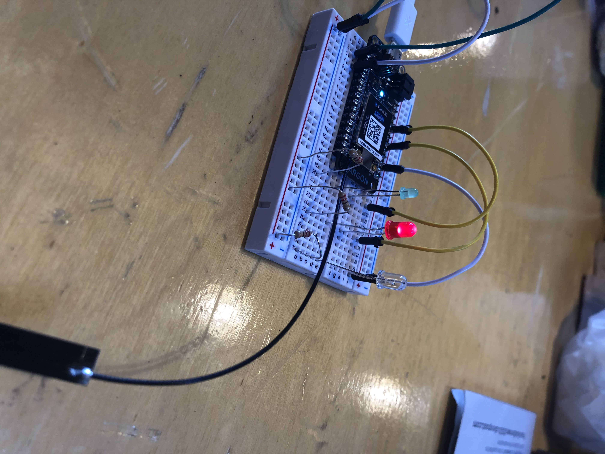

# Hack@Brown 2020 Project

## Inspiration
We entered this hackathon with the goal of working on a project using only technology that both of us were completely new to or had limited experience with. After attending the various workshops throughout the day and exploring the hardware room, we decided we wanted to build something that would require both a Particle Argon and a web app using Flask and a SQL database.

## What it does
Any user can ask the Magic 3 Light a question through our web interface, and the Particle Argon will sequentially pulse, slot-machine style, and create suspense until it stops on one of the three lights, which represent yes, no, or maybe. The information is then displayed on the website and added to a log of all of the questions and answers.

## How we built it
We started building this project by adding the 3 LED lights to the Particle Argon circuit board. Then, we coded the lighting sequence for the particle in Arduino. We utilized Flask to build our web interface and used http post requests to transfer the information between our particle and web app.

## Challenges we ran into
Since most of the technology we were dealing with was completely new to us, we, obviously, ran into a couple of roadblocks along the way. The largest of which came when setting up the Particle's circuit. Both of us had zero hardware knowledge and knew nothing about circuits, and online tutorials were impossible to follow without having a general idea about how circuits work. Gareth, one of the mentors who had hardware background, came to our rescue, however, when he gave us a thorough and detailed walkthrough into implementing basic circuits on the Particle. He provided us with essential background into the workings of diode lights and allowed us to create our Magic 3 Light.

## Accomplishments that we're proud of
We're proud of all of the different technologies that we got to learn in such a short time. Not only did we learn so many new things, but we also got to make something real and tangible out of it. We were also especially proud of getting the particle to interact with our web app as that was an obstacle that seemed the most daunting while working on the project.

## What we learned
We learned the basic workings of a circuit and about the power of IoT technology through our Argon Particle. We both knew basic web dev with HTML and JavaScript, so we got to learn a new way to make web apps with Flask. We got a lot more familiar with Python and SQL databases as well. But more importantly, we learned to reinforce the mindset of learning and growth.

## What's next for Magic 3 Light
We may tinker with the light and Argon Particle using motors and speakers to enhance the user experience.
